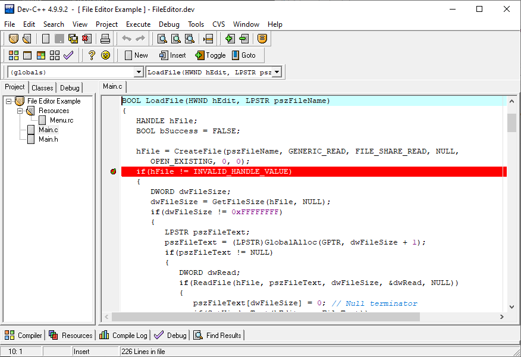

# Evolution of the C++ Language: Standards, Compilers, Development Environment

- [Evolution of the C++ Language: Standards, Compilers, Development Environment](#evolution-of-the-c-language-standards-compilers-development-environment)
  - [C++ Language History](#c-language-history)
  - [Language Philosophy](#language-philosophy)
  - [Current State of the Language](#current-state-of-the-language)
  - [Compilers](#compilers)
    - [GCC](#gcc)
    - [MSVC](#msvc)
    - [Intel C++ Compiler](#intel-c-compiler)
    - [clang](#clang)
    - [llvm](#llvm)
  - [Integrated Development Environments](#integrated-development-environments)
    - [Code::Blocks](#codeblocks)
    - [Dev-C++](#dev-c)
    - [NetBeans](#netbeans)
    - [Eclipse](#eclipse)
    - [Visual Studio Code](#visual-studio-code)
    - [Visual Studio](#visual-studio)
    - [CLion](#clion)
  - [References](#references)

## C++ Language History

The language was created by **Bjarne Stroustrup** in the early 1980s as an evolution of the _C_ language, aiming to add features from Simula, namely classes and objects. Initially, the language was called _"C with classes"_. A preliminary description was published as a technical report at Bell Labs in April 1980 [^1].

Stroustrup followed these criteria in the language's development:

- A good tool should provide means for organizing programs similar to those in _Simula_: classes, their hierarchy, support for concurrency, and strong (i.e., static) type checking based on classes. These criteria were considered essential for supporting the design process, not just implementation.
- It should generate programs that run as fast as those written in _BCPL_ (a predecessor of C) and have BCPL's ability to link separately compiled modules into a single program. There should be a simple linkage convention to allow combining modules written in different languages such as C, Algol68, Fortran, BCPL, assembler, etc. Otherwise, programmers would be limited by the constraints of a single language.
- The tool should provide a portable implementation, so there should be multiple sources of implementation. There should not be a complex runtime support system that is hard to port, and only very limited dependence on the operating system is allowed.

The early version of the language was publicly available from 1983 and implemented:

- classes;
- derived classes (but without virtual functions yet);
- access control - public/private;
- constructors and destructors;
- functions called on entry and exit (later removed);
- friend classes;
- type checking and conversion of function arguments;
- inline functions;
- default arguments;
- assignment operator overloading.

In 1984, support for virtual functions was added, marking the announcement of object-oriented programming support.

To work with the new language, Stroustrup developed _cfront_ - a translator (preprocessor) from the new language to C. This preprocessor guided the language's development for many years, but after an attempt to add exception handling, it was abandoned.

## Language Philosophy

The following goals were pursued in the development of C++:

- create a programming language that makes programming more enjoyable for serious programmers;
- better than C;
- support data abstractions;
- support object-oriented programming.

This led to the following principles:

- The evolution of C++ should be driven by real-world problems;
- Avoid chasing perfection for its own sake;
- C++ should be useful now;
- Every feature should have a clear implementation;
- Always leave a migration path;
- C++ is a language, not a complete system;
- Provide comprehensive support for each supported programming style;
- Do not force anything unnecessarily;
- Support established design methods;
- Provide means for organizing programs;
- Say exactly what is meant;
- All features should be adequate;
- It is more important to include a useful feature than to prevent misuse;
- Support building programs from independently developed parts;
- No implicit violations of the static type system;
- Provide user-defined types with the same support as built-in types;
- Locality is good;
- Avoid dependence on order;
- When in doubt, choose the option that is easier to teach;
- Syntax is important, even if sometimes illogical;
- Avoid using the preprocessor;
- Use traditional linkers;
- No unjustified incompatibilities with C;
- Leave no room for a language lower-level than C++, except for assembler;
- Zero-overhead principle: you don't pay for what you don't use;
- When in doubt, provide means for manual control.

## Current State of the Language

By the late 1980s, C++ [^2] had gained popularity, resulting in many compilers, each with its own features. As a result, a program written for one compiler might not compile with another (and for large projects, this was almost guaranteed). Therefore, in 1998, the first C++ standard was released, defining the language model, syntax, standard library, etc.

In 2003, a new C++ standard was released, but it only contained corrections to the previous standard.

When developing each section of the future C++ standard, the following rules are followed:

1. support language stability and ensure compatibility with C++98 and, if possible, with C;
2. prefer introducing new features through the standard library rather than the language core;
3. prefer changes that improve programming techniques;
4. improve C++ in terms of system and library design, rather than adding features useful only for specific applications;
5. increase type safety to provide a safe alternative to current unsafe approaches;
6. increase performance and the ability to work directly with hardware;
7. address real, widespread problems;
8. make C++ easier to learn without removing features used by expert programmers.

Attention is paid to beginners, who will always make up the majority of programmers. Many beginners do not seek to deepen their knowledge of C++, limiting themselves to using it for narrow, specific tasks. Moreover, given the versatility and wide use of C++ (including various applications and programming styles), even professionals may be beginners when using new programming paradigms.

History of standards with their important changes:

- __C++11__
  - Universal initialization
  - Move constructors and assignment operators
  - Type inference
  - Range-based for loop
  - Lambda expressions
  - Various syntax additions (nullptr, parsing of `>>`)
- __C++14__
  - Bug fixes for the _C++11_ standard
- __C++17__
  - Trigraphs removed
  - `register` keyword removed
  - `++` operation for `bool` removed
  - Filesystem library
  - Variant type `std::any`
  - Parallel versions for several algorithms
- __C++20__
  - Bug fixes for the _C++17_ standard
  - Modules
  - Coroutines
  - Three-way comparison operator (spaceship)
  - Concepts
  - String literals as template parameters
  - Named structure initialization
  - Formatting library
  - Bit manipulation library
  - Ranges library
  - Calendar/time library
- __C++23 [^3]__
  - Bug fixes for the _C++20_ standard

## Compilers

### GCC

[GCC (GNU Compiler Collection)](https://gcc.gnu.org) is a set of compilers for various programming languages, developed as part of the GNU project. GCC is free software, distributed by the Free Software Foundation (FSF) under the GNU GPL and GNU LGPL, and is a key component of the GNU toolchain. It is used as the standard compiler for free UNIX-like operating systems.

Originally called the GNU C Compiler, it only supported the C language. Later, GCC was extended to compile source code in languages such as C++, Objective-C, Java, Fortran, Ada, Go, GAS, and D.

Currently, GCC is maintained by a global community of programmers and supports more processors and operating systems than any other compiler.

As the official compiler of the GNU system, GCC is also the main compiler for building several other operating systems, including various Linux and BSD variants (previously, now Clang LLVM is used), as well as ReactOS, macOS, OpenSolaris, NeXTSTEP, BeOS, and Haiku.

GCC is often chosen for developing software that needs to run on many different hardware platforms. Differences between the "native" compilers for each hardware platform make it difficult to develop code that compiles correctly with different compilers, and using different compilers complicates build scripts for software targeting all platforms. Using GCC to compile code for different platforms uses the same parser. Therefore, if you manage to build a program for one target platform, it is likely to build for others as well.

To use GCC on Windows, the following are commonly used:

- [MSYS2](https://www.msys2.org) - an environment for building and running Unix programs on Windows;
- [MingW](https://www.mingw-w64.org) - a minimal set of tools for building Windows programs;
- [Cygwin](https://www.cygwin.com) - a set of free programs and libraries for running and compiling Unix programs on Windows.

### MSVC

[MSVC (Microsoft Visual C++)](https://learn.microsoft.com/en-us/cpp/) is a compiler for C++ applications, developed by Microsoft and supplied either as part of Microsoft Visual Studio or separately as a free, functionally limited [Microsoft Visual Studio Community Edition](https://visualstudio.microsoft.com/downloads/).

### Intel C++ Compiler

[Intel C++ Compiler](https://www.intel.com/content/www/us/en/developer/tools/oneapi/dpc-compiler.html) is an optimizing compiler developed by Intel for x86, x86-64, and IA-64 processors. Its main advantage is high-level and target-specific optimizations for Intel processors. The compiler works on Linux, Windows, and macOS.

### clang

[Clang](https://clang.llvm.org) is a frontend for the C, C++, Objective-C, Objective-C++, and OpenCL C programming languages, used together with the LLVM framework. Clang translates source code into LLVM bytecode, which is then optimized and code-generated by the framework.

The project's goal is to create a replacement for the GNU Compiler Collection (GCC). Development is open source as part of the LLVM project.

The project involves employees from several companies, including Google and Apple. The source code is available under a BSD-like license.

### llvm

LLVM (Low Level Virtual Machine) is a project for a compiler infrastructure and related tools. It consists of a set of compilers for high-level languages ("frontends"), a system for optimization, interpretation, and compilation to machine code.

Written in C++, it provides optimizations at compile time, link time, and runtime. Initially, the project implemented compilers for C and C++ using the Clang frontend, but later frontends for many languages appeared, including C#, Fortran, Haskell, Java (bytecode), JavaScript, Ruby, Rust, Scala, Swift, and many others.

LLVM can generate machine code for many architectures, including ARM, x86, x86-64, PowerPC, MIPS, SPARC, RISC-V, and others (including Nvidia and AMD GPUs).

To compile C++ code, LLVM uses its own version of the GCC compiler.

## Integrated Development Environments

An Integrated Development Environment (IDE) is software application designed to facilitate software development. An IDE usually includes a text editor, compiler, debugger, and other tools needed for software development. Nowadays, it is hard to imagine developing complex software without an IDE. You can write a small program in a simple text editor and compile it from the command line, but for large projects, this approach is unproductive.

There are many IDEs for C++, some of which are described below.

### Code::Blocks

[Code::Blocks](http://www.codeblocks.org) is a free IDE for creating software in C++. Code::Blocks is cross-platform, allowing its use on Windows, Linux, and macOS. It is often used for teaching C++ programming in schools and universities.

### Dev-C++

[Dev-C++](https://github.com/Embarcadero/Dev-Cpp) is a free IDE for C++ for Windows. Dev-C++ includes the MinGW compiler, which allows compiling C++ programs for Windows. It is an outdated IDE but is still used for teaching C++ programming in schools.

### NetBeans

[NetBeans](https://netbeans.apache.org) is a free IDE for creating software in various programming languages, including C++. The product was created by Sun Microsystems and is now developed by the community with support from the Apache Software Foundation. NetBeans is cross-platform, allowing its use on Windows, Linux, and macOS.

### Eclipse

[Eclipse](https://www.eclipse.org) is a free IDE for creating software in various programming languages, including C++. It is developed by the community with support from the Eclipse Foundation. Eclipse is cross-platform, allowing its use on Windows, Linux, and macOS.

### Visual Studio Code

[Visual Studio Code](https://code.visualstudio.com) is a free IDE for creating software in various programming languages, including C++. Developed by Microsoft. Thanks to a large number of extensions, Visual Studio Code can be used for developing software in many languages (and more), making it one of the most popular IDEs. Visual Studio Code is cross-platform, allowing its use on Windows, Linux, and macOS.

### Visual Studio

[Visual Studio](https://visualstudio.microsoft.com) is an IDE from Microsoft for creating software in various programming languages, including C++. Visual Studio is a powerful tool covering all stages of software development, including design, development, testing, and debugging, making it a common choice for large projects. The main compiler used in Visual Studio is MSVC. Visual Studio is primarily available for Windows, but exists MacOS version also.

There is also a Visual Studio Community Edition, which is free for non-commercial use. In this case, you need to register on the Microsoft website and obtain a license for Visual Studio Community Edition. This version allows full development but is limited in design and code analysis.

### CLion

[CLion](https://www.jetbrains.com/clion) is an IDE from JetBrains for creating software in C++. CLion is a powerful tool covering all stages of software development, including design, development, testing, and debugging, making it a common choice for large projects. CLion uses GCC, MSVC, Clang, and other compilers. CLion is cross-platform, allowing its use on Windows, Linux, and macOS.

There is an educational license for students and teachers, allowing free use of CLion. In this case, you need to request a license on the JetBrains website using your educational institution's email.

## References

[^1]: [Bjarne Stroustrup, Design and Philosophy of C++](https://www.stroustrup.com/dne.html)
[^2]: [C++, Wikipedia](https://en.wikipedia.org/wiki/C%2B%2B)
[^3]: [C++23, Wikipedia](https://en.wikipedia.org/wiki/C%2B%2B23)
